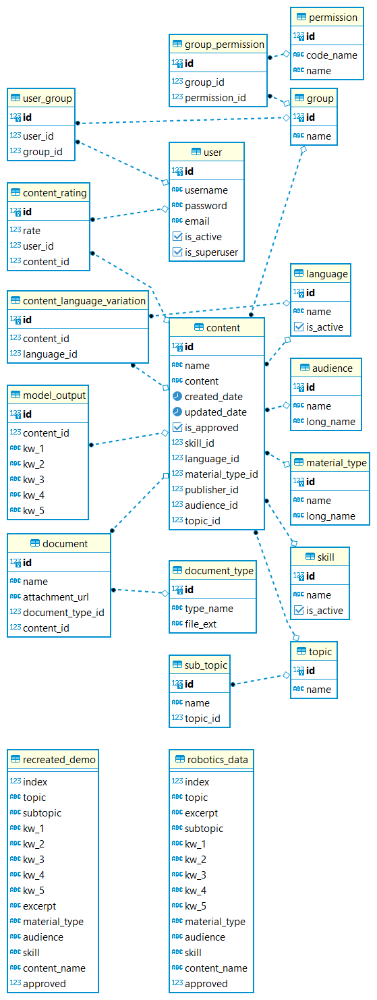

# Database Connection

**We are aware that we shouldn't put the password and superuser username on the README. However, We did for educational purpose.**

```python
host: openedupgserver.postgres.database.azure.com
region: East US (US)
username: openedudadmin
password: UXK6EDsaAwZBP3r
JDBC_con_string: jdbc:postgresql://openedupgserver.postgres.database.azure.com:5432/openedud?user=openedudadmin&password=UXK6EDsaAwZBP3r&sslmode=require
```


